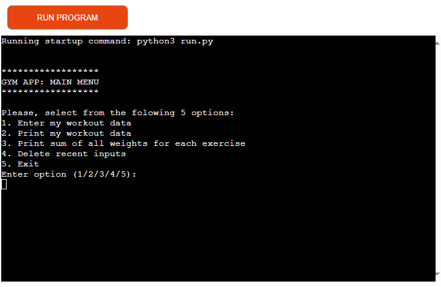
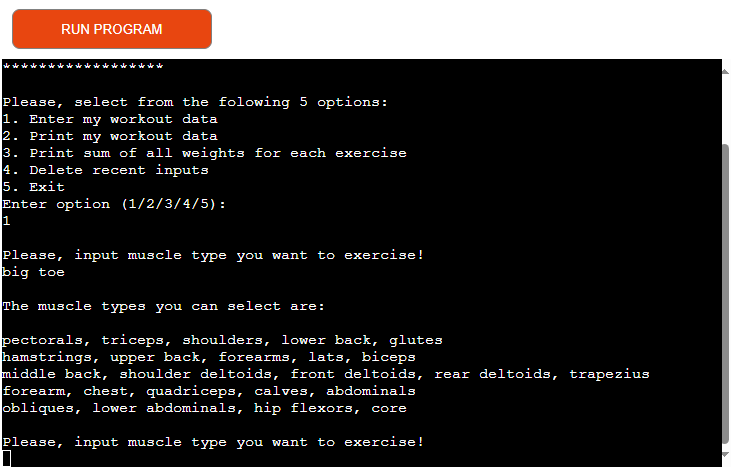
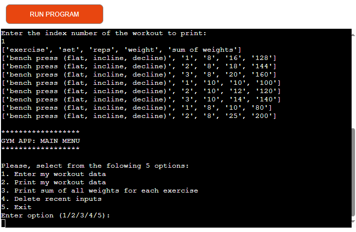
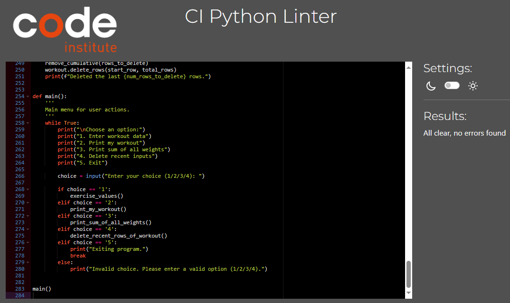

# Gym Workout Tracker

This Python application utilizes Google Sheets through the `gspread` library to manage and track gym workouts, allowing users to input and view their exercise data, and manage cumulative workout statistics.

## Features

- **Enter Workout Data:** Users can input workout data including the exercise name, number of sets, repetitions per set, and weight used per set.
  
- **View Workout Data:** Allows users to select and view workout data for a specific exercise.
  
- **View Cumulative Weights:** Displays the sum of all weights lifted for each exercise.
  
- **Delete Recent Inputs:** Enables users to delete a specified number of the most recent workout entries.
- **Dynamic Data Management:** Automatically updates cumulative data in the 'cumulative' worksheet based on user actions.

## Setup

1. **Google Sheets API Configuration:**
   - Enable the Google Sheets API and create credentials for a service account in the Google Cloud Platform.
   - Download the service account credentials JSON file.

2. **Python Environment:**
   - Ensure Python is installed on your system.
   - Install the `gspread` and `oauth2client` packages using pip:
     ```
     pip install gspread oauth2client
     ```

3. **Configuration:**
   - Place the service account credentials JSON file in your project directory.
   - Share your Google Sheet with the email address of your service account.

4. **Usage:**
   - Run the Python script to interact with your Google Sheet data:
     ```
     python3 run.py
     ```

## Testing

- **PEP8 Guidelines**: The code conforms to PEP8 guidelines for Python code style.

- **Manual Testing**: Extensive manual testing conducted for invalid inputs, ensuring robust input validation.
- **Platform Testing**: Successfully tested on both Heroku and a local terminal environment.

## Deployment

To use this application, you'll need a Google Sheet set up as your data store. Follow these steps for deployment:

1. **Google Sheets Setup**: Create a new Google Sheets document and name it accordingly (e.g., "gym_app"). Set up worksheets named 'exercise' and 'cumulative' for tracking workouts and cumulative data, respectively.
2. **Google Cloud Platform**: Set up a project in the Google Cloud Platform, enable the Google Sheets API, and create credentials (service account key) for accessing your Google Sheet from the Python application.
3. **Heroku Deployment**:
    - Sign up for a Heroku account at [Heroku](https://www.heroku.com/).
    - Follow the steps to deploy a Python app, including setting up a `Procfile`, `requirements.txt`, and configuring environment variables for your Google Sheets credentials.
    - Deploy your application through the Heroku Dashboard or Heroku CLI.

## Credits

- **Google Sheets Tutorial**: [Link to Tutorial](https://www.youtube.com/watch?v=N2opj8XzYBY)
- **Python Tutorial**: [Link to Tutorial](https://www.youtube.com/watch?v=rfscVS0vtbw)

## Bugs

There are no remaining bugs in the application.

## Solved Bugs

- **Data Update Issue**: Initially encountered issues with updating data across worksheets, which was resolved by ensuring synchronous updates and proper fetching of worksheet data.

## Functions

- `input_muscle_data()`: Prompts the user to input a valid muscle type.
- `choose_exercise()`: Allows selection of an exercise based on muscle type.
- `number_of_sets()`: Inputs the number of sets, ensuring a positive integer.
- `exercise_values()`: Captures and records workout data.
- `update_cumulative()`: Updates or appends cumulative workout data.
- `get_integer_input()`: Ensures user inputs are valid positive integers.
- `print_my_workout()`: Displays workout data for chosen exercises.
- `print_sum_of_all_weights()`: Outputs the cumulative weight lifted per exercise.
- `remove_cumulative()`: Adjusts cumulative data before deleting workout rows.
- `delete_recent_rows_of_workout()`: Deletes the last N rows from the workout sheet.
- `main()`: Provides a menu for user interaction.

## Contributions

Contributions to this project are welcome. Please ensure to follow best practices for code contributions and adhere to the existing coding style.

## License

This project is open-sourced under the MIT License. See the LICENSE file for more details.
